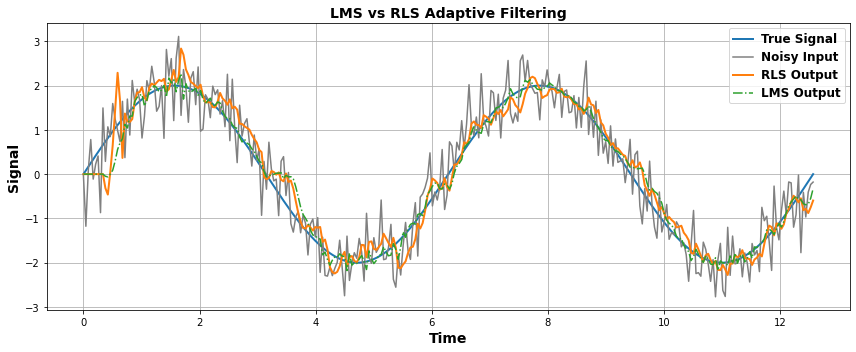
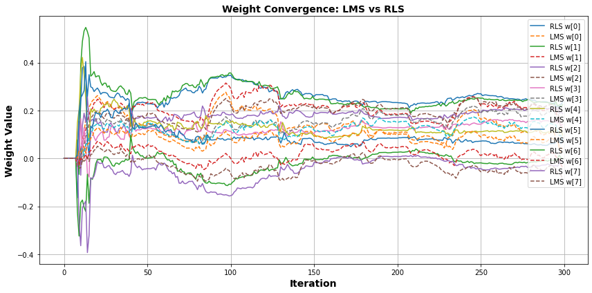
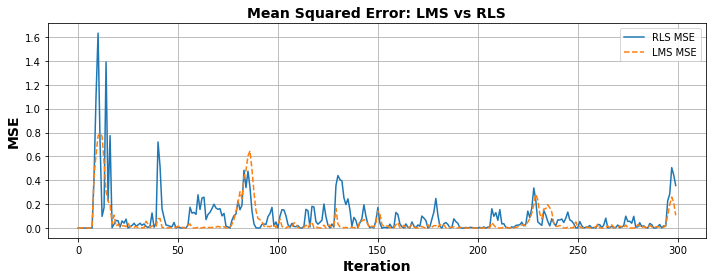

# RLS vs LMS Adaptive Filter — Noise Cancellation Demo

A Python educational demo comparing **Recursive Least Squares (RLS)** and **Least Mean Squares (LMS)** filters for estimating a clean signal from noisy observations.

## Overview

This project simulates a noisy sine wave and applies both RLS and LMS adaptive filters to recover the clean signal. It includes:

- Side-by-side implementation of LMS and RLS
- Signal estimation plots
- Weight convergence plots
- MSE (Mean Squared Error) performance comparison

## Problem Setup

- **True Signal**: A sine wave `2 * sin(t)`
- **Noise**: Gaussian noise added to the signal
- **Goal**: Reconstruct the clean signal using adaptive filters

---

## Algorithms

### LMS (Least Mean Squares)

An iterative gradient descent method that updates weights using the instantaneous squared error:

```python
w[n+1] = w[n] + μ * e[n] * x[n]
```

- Simple and fast
- Requires careful tuning of `μ` (learning rate)
- Slower convergence than RLS

### RLS (Recursive Least Squares)

Minimizes the exponentially weighted sum of squared errors:

J(n) = Σ [ λ^(n−i) · ( d(i) − w(n)ᵀ · x(i) )² ]

- d(i): desired (true) output
- x(i): input vector
- w(n): adaptive weights at time n


Update equations:
```python
k = (P @ x) / (λ + x.T @ P @ x)
w = w + k * e
P = (P - np.outer(k, P @ x)) / λ
```

- Faster convergence
- More complex and computationally heavy

---

## Parameters

| Symbol | Meaning                       |
|--------|-------------------------------|
| `M`    | Filter length (# of taps)     |
| `μ`    | LMS learning rate             |
| `λ`    | RLS forgetting factor         |
| `δ`    | RLS initialization constant   |

---

## Results

### Signal Reconstruction
A plot comparing:
- True Signal
- Noisy Input
- RLS Filter Output
- LMS Filter Output
- 
## LMS vs RLS Signal Comparison



### Weight Convergence
Watch how each filter's weights evolve over time — see how quickly and smoothly each stabilizes.




### MSE Comparison
Track squared prediction error over time for both RLS and LMS.


---

## Applications
- EEG, ECG, fNIRS, EMG signal denoising
- Real-time biosignal enhancement
- Wearable sensor filtering

---

## Author
Sahar Jahani  
[GitHub Profile](https://github.com/Jahani-dev)
